Luvita Sianturi
NPM : D1A241000

ini merupakan sistem sederhana dengan tampilan frontend, login, dan backend.
tampilan frontend berisi menu artikel, gallery, about, dan menu untuk login.
pada tampilan login berisi form login dengan form username dan password untuk melakukan login.
setelah melakukan login, dapat mengakses tam[ilan dashboard yang berisi kelola artikel, kelola gallery, kelola about, dan button log out.
setiap menu kelola berisi fungsi/aksi seperti tambah data, edit data, dan delete data.

  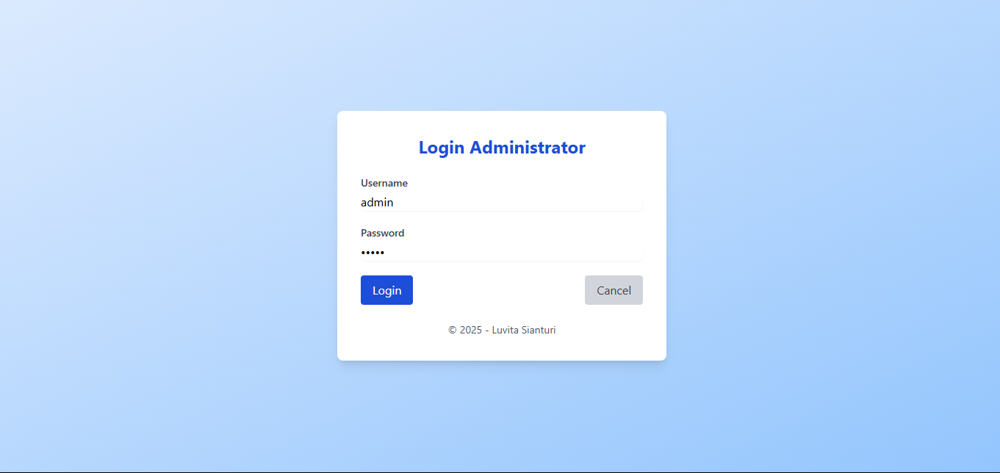

div>
  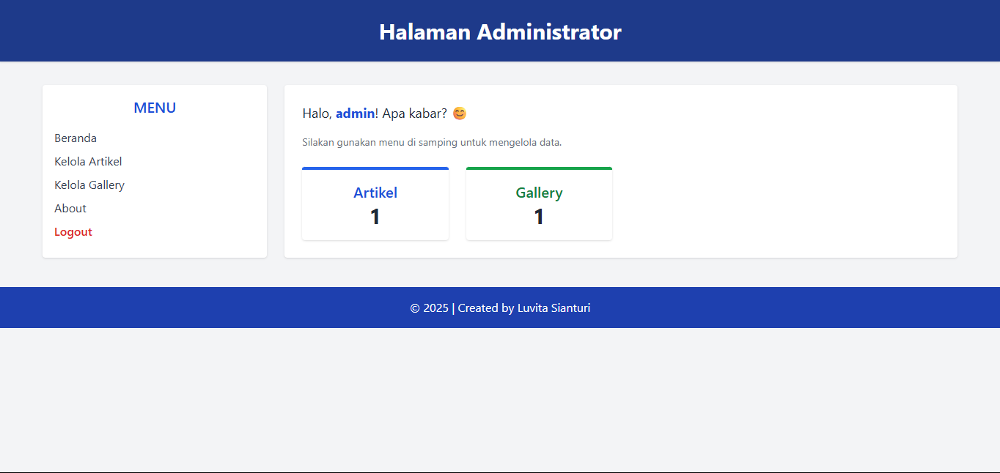

div>
  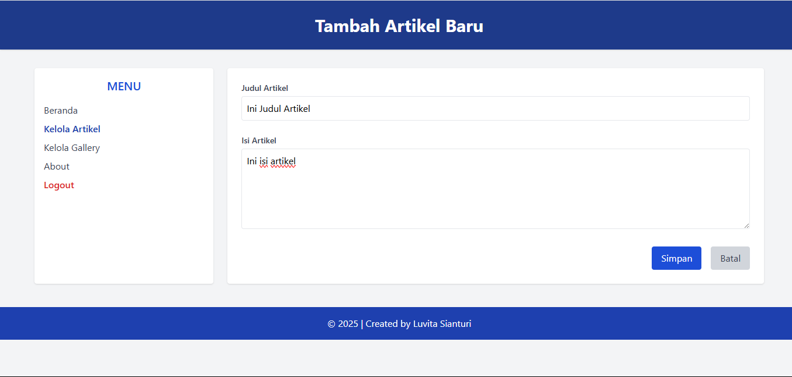

div>
  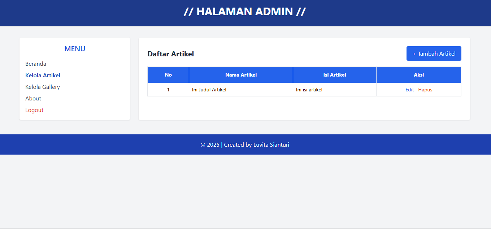

div>
  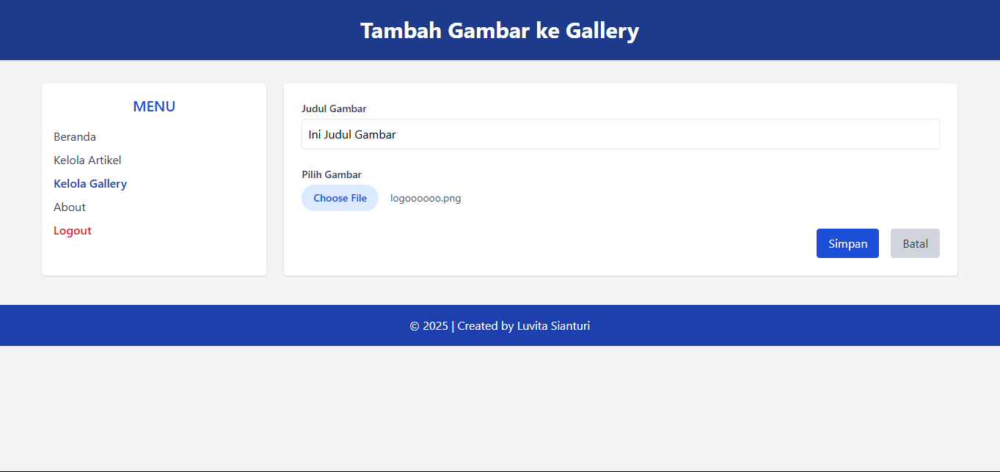

div>
  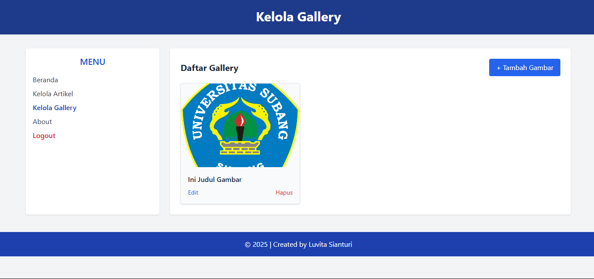

div>
  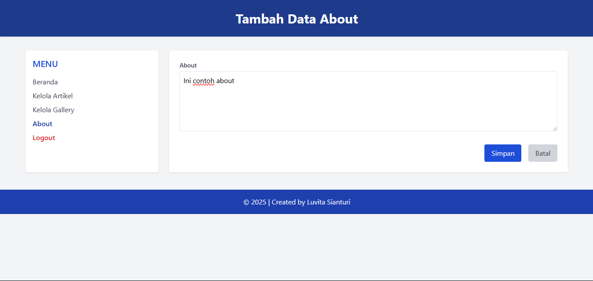

div>
  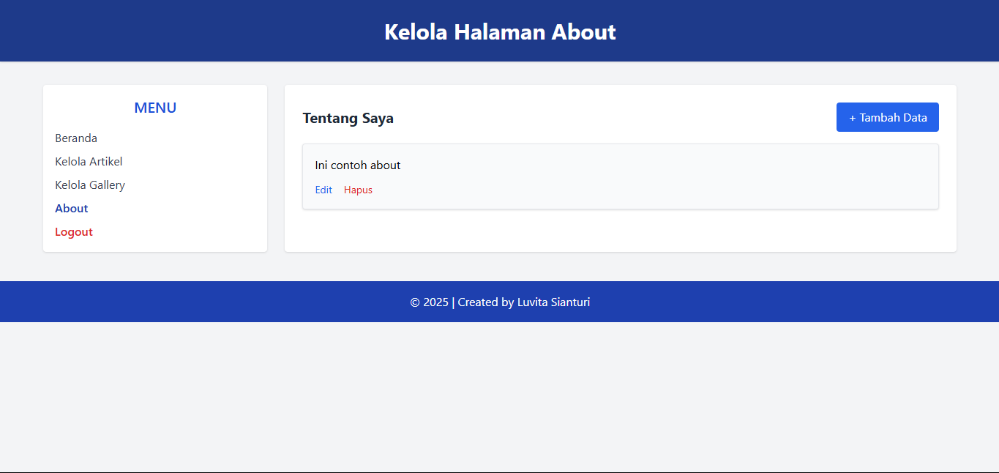

div>
  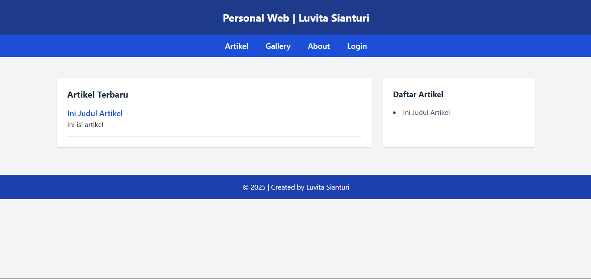

div>
  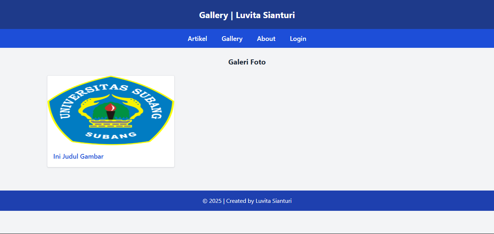

div>
  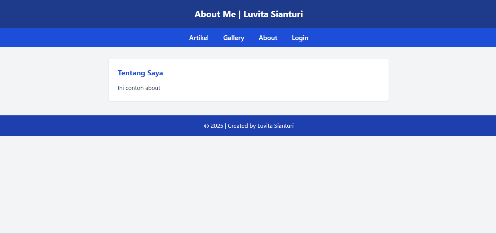

